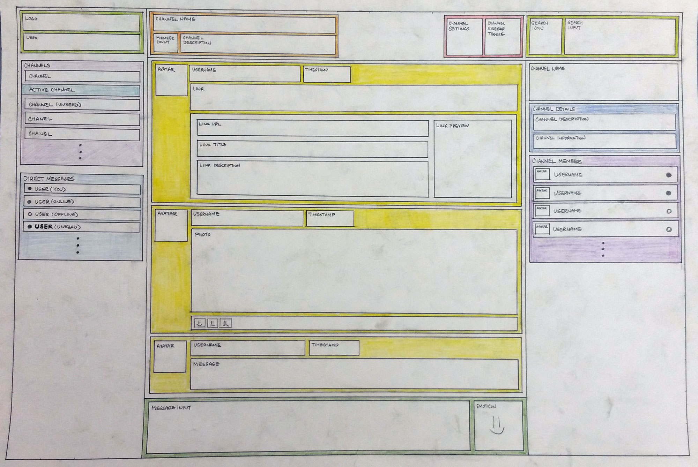
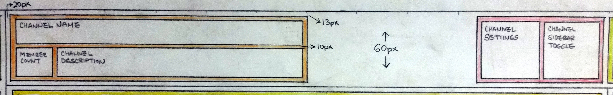
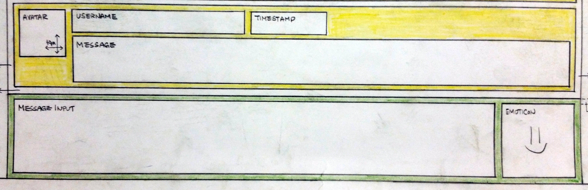

# SlackOff


SlackOff is a clone of a popular chat client, Slack.

Live Site: [http://slackoff.today]

## Implementation

SlackOff utilizes the following:

- Ruby on Rails
- React.js
- Redux
- PostgreSQL
- AWS S3
- jQuery
- Heroku
- BCrypt
- Figaro
- Paperclip
- jBuilder
- react-modal
- react-alert

## Features

The chat application is composed of three main features:

### Authentication

BCrypt gem is utilized in order to hash a password, and only the digest of the user is saved into the database.  A cookie storing a BCrypt token is used to keep track of the user's current session.  Without a valid matching session token, the user is redirected to the login page.  

### Live Chat

Pusher API is utilized for maintaining a Websocket TCP-based protocol connection which allows bi-directional communication between the server and the client.  


```javascript
const channelId = this.props.user.currentChannel.toString();
this.channel = this.pusher.subscribe(channelId);

this.channel.bind('message', (data.message) => {
  this.props.receiveMessage(data.message);
}, this);

this.channel.bind('editMessage', (data) => {
  this.props.editMessage(data.message);
}, this);

this.channel.bind('deleteMessage', (data) => {
  this.props.removeMessage(data.messageId);
}, this);
```

When a user accesses the main application page, the client is subscribed to the Pusher channel.  From this channel, the client receives a specified event such as `message`, `editMessage` and `deleteMessage`.  The message event triggers the `receiveMessage` action which updates the application's Redux store through the reducer.  Once the store updates, React re-renders the chat view through the utilization of the virtual DOM.

```ruby
class Api::MessagesController < ApplicationController
  def create
    Pusher.trigger(@channel.id, 'message', {
      messages: new_message
    })
  end
end
```

The Rails backend receives the request from the AJAX thunk action generated by the frontend, retrieves the data from the PostgresSQL database, and then constructs a JSON response to be returned through Pusher.

### Channels


Public channels can be created/joined/subscribed by all users of the application.  A user can have many channels and a channel can have many users through a subscription join table.

```javascript
this.channel = this.pusher.subscribe('channels');

this.channel.bind('update', (data) => {
  this.props.receiveChannel(data.channel);
}, this);
```

When a channel name is changed, the changed name is broadcasted to all the clients for a real-time update of the changes made.


A user can browse through all the channels through the Channels View.  

```javascript
constructor(props) {
  this.state = {
    channels: [],
    searchInput: ''
  };
}

handleInput(e) {
  this.setState({ searchInput: e.target.value });
}

matches() {
  return this.state.channels.filter((channel) => channel.name.includes(this.state.searchInput));
}
```

The auto-completion for the channels search is implemented by updating the state of the channel list with the user's search input.

### Direct/Team Messaging


A user can send a direct message to another user or multiple users in the application.

```ruby
create_table "channels", force: :cascade do |t|
  t.boolean  "private", default: false
end
```

Direct and Team messaging capability is implemented through creation of private channels.


```javascript
this.channel = this.pusher.subscribe('directMessage');

this.channel.bind('notify', (data) => {
  if(data.private === true
     && data.authorId !== this.props.user.id
     && data.channelId !== this.props.channel.id) {
    this.showDirectMessageAlert(data.author);
  }
}, this);
```

When a new message is dispatched through Pusher from the Rails backend, an alert popup is displayed to notify the user that a new direct message was received. This alert, created with `react-alert` package, is only triggered when the channel the user is currently browsing is not the channel the user is currently viewing.

## Avatar


The avatar functionality has been implemented by utilizing `Paperclip` gem and AWS S3.  The API keys have secured using `Figaro` gem.

```javascript
updateFile(e) {
  const file = e.currentTarget.files[0];
  const fileReader = new FileReader();

  fileReader.onloadend = () => {
    this.setState({ photo_url: fileReader.result });
  }

  if (file)
    fileReader.readAsDataURL(file);
}

submitForm(e) {
  e.preventDefault();

  let formData = new FormData();

  formData.append('user[id]', this.props.user.id);
  formData.append('user[email]', this.state.email);
  formData.append('user[photo_url]', this.state.photo_url);

  this.props.updateUser(formData).then(() =>
    this.props.closeEditUserFormModal()
  );
}
```

```javascript
export const updateUser = (formData) => {
  return $.ajax({
    method: 'patch',
    url: `api/users/${formData.get('user[id]')}`,
    contentType: false,
    processData: false,
    data: formData
  })
}
```

The user can upload an avatar during the signup process, or the user can edit his or her profile through the user menu within the main application.  The image data is stored through the FormData interface, then submitted to the Rails API where the Paperclip gem automatically stores the file into AWS S3.

## Design

### Wireframe







A detailed wireframe was produced during the earliest stages of the planning. Each color represents a React container, and each box represents a different React component. All of the necessary dimensions and the relative positional values have been measured on the wireframe. The wireframe was crucial to accelerating the implementation of the visual.

### UI/UX

```javascript
<ReactCSSTransitionGroup
  transitionName='list'
  transitionEnterTimeout={500}
  transitionLeaveTimeout={500}>
  { this.buildChannelItems() }
</ReactCSSTransitionGroup>
```

```css
.list-enter {
  opacity: 0.01;
  transform: translateY(500%);
}

.list-enter.list-enter-active {
  opacity: 1;
  transform: translateY(0);
  transition: opacity 150ms ease-in, transform 150ms ease-in;
}

.list-leave {
  opacity: 1;
  transform: translateY(0);
}

.list-leave.list-leave-active {
  opacity: 0.01;
  transform: translateY(500%);
  transition: opacity 150ms ease-in, transform 150ms ease-in;
}
```

SlackOff is designed with satisfying UI/UX in mind.  Through React animation API, smooth transitional effects have been implemented to visually notify the user that he or she is interacting with an actionable item.  The usage of SCSS assures a streamlined workflow, and helps achieve the consistent overall visual of the website.

## Future Release

* [X] Notification
* [X] Avatar Upload
* [ ] Emoticons
* [ ] Multiple Sessions
* [ ] Messages Search
